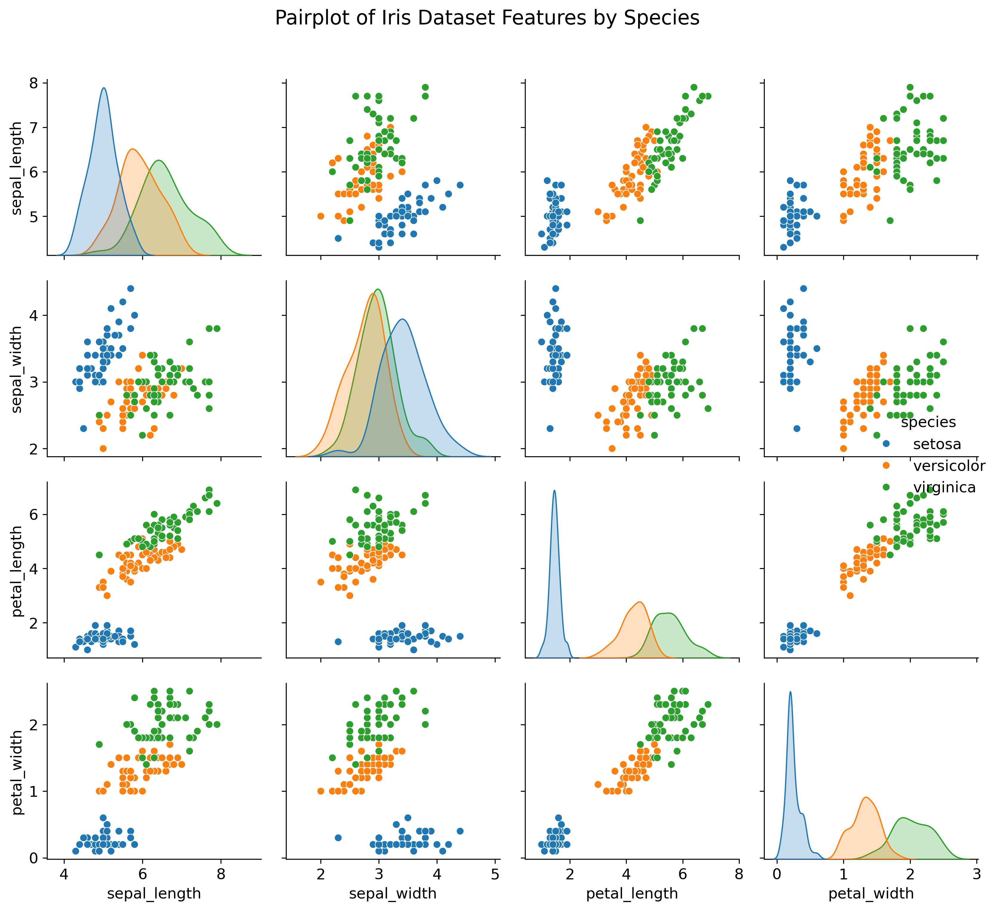
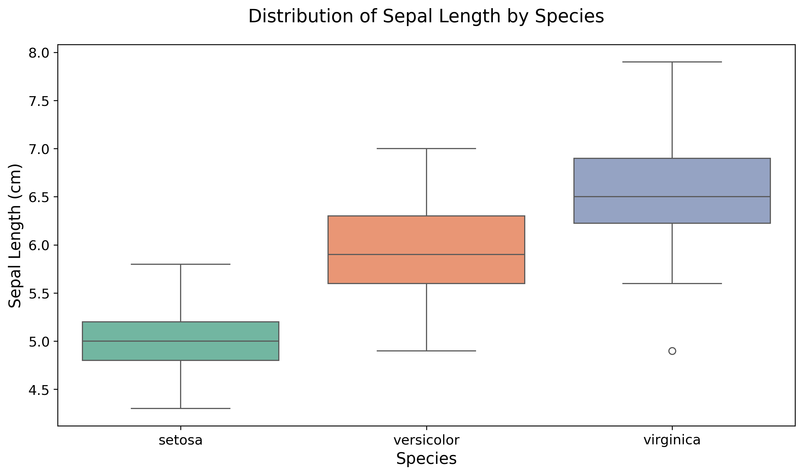
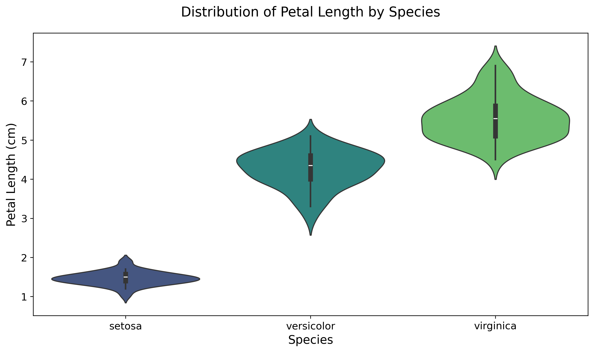
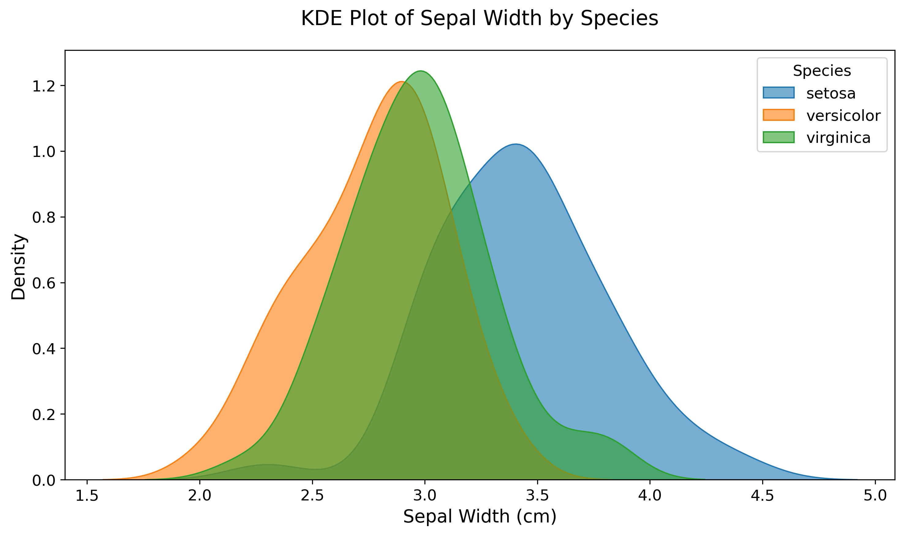
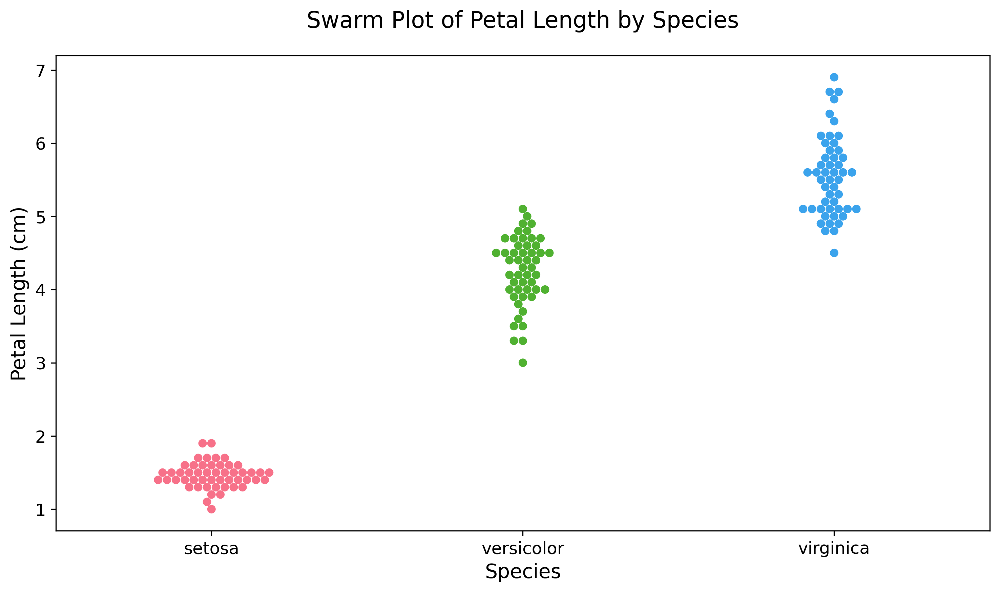
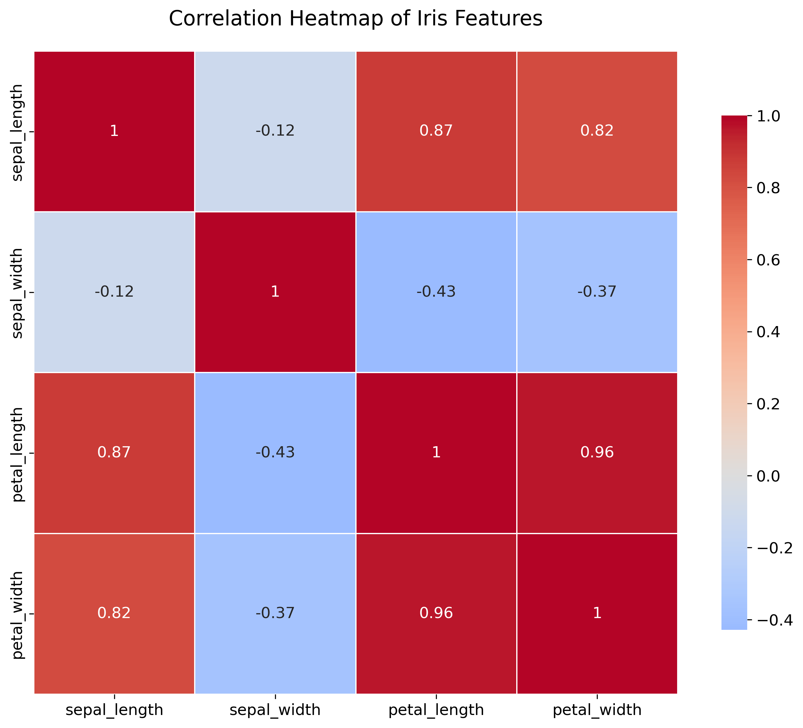
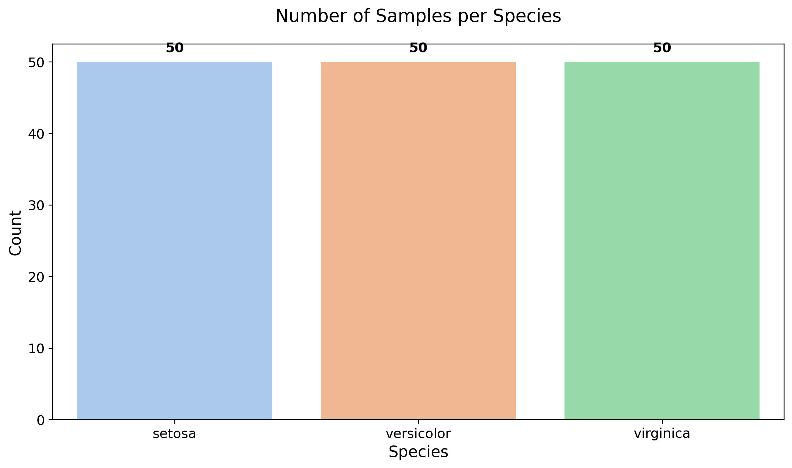

# Iris Dataset - Exploratory Data Analysis

## Overview

This project performs a comprehensive exploratory data analysis (EDA) on the famous Iris dataset. The Iris dataset is one of the most well-known datasets in machine learning and statistics, containing measurements of 150 iris flowers from three different species: Iris setosa, Iris versicolor, and Iris virginica.

The dataset contains four numerical features for each flower:
- **Sepal Length** (cm): Length of the sepal
- **Sepal Width** (cm): Width of the sepal  
- **Petal Length** (cm): Length of the petal
- **Petal Width** (cm): Width of the petal

Each species has exactly 50 samples, making this a perfectly balanced dataset ideal for classification tasks. The dataset was first introduced by British statistician and biologist Ronald Fisher in 1936 and has since become a standard benchmark for testing machine learning algorithms and data analysis techniques.

## Project Structure

```
mini-task-3-iris-eda/
├── iris_eda.ipynb          # Jupyter notebook with complete EDA
├── iris_eda.py             # Python script version of the analysis
├── iris_dataset.csv        # Clean dataset in CSV format
├── README.md               # This file
└── plots/                  # Directory containing all generated visualizations
    ├── 01_pairplot.png
    ├── 02_boxplot_sepal_length.png
    ├── 03_violin_petal_length.png
    ├── 04_kde_sepal_width.png
    ├── 05_swarm_petal_length.png
    ├── 06_correlation_heatmap.png
    └── 07_count_plot.png
```

## Requirements

To run this analysis, you'll need the following Python packages:

```
pandas
numpy
matplotlib
seaborn
scikit-learn
jupyter (for running the notebook)
```

Install them using:
```bash
pip install pandas numpy matplotlib seaborn scikit-learn jupyter
```

## Running the Analysis

### Option 1: Jupyter Notebook (Recommended)
```bash
jupyter notebook iris_eda.ipynb
```

### Option 2: Python Script
```bash
python iris_eda.py
```

## Visualizations

### 1. Pairplot - Overall Relationships


**Key Insight:** The pairplot reveals clear separation between species, especially setosa which is distinctly different from the other two species. Petal measurements show stronger discriminative power than sepal measurements.

### 2. Boxplot - Sepal Length Distribution


**Key Insight:** Virginica has the longest sepal length on average, followed by versicolor, then setosa. There's some overlap between versicolor and virginica, but setosa is clearly distinct.

### 3. Violin Plot - Petal Length Distribution


**Key Insight:** Petal length shows excellent species separation with minimal overlap. Setosa has significantly shorter petals, while virginica has the longest petals. The violin plot reveals the distribution shape within each species.

### 4. KDE Plot - Sepal Width Distribution


**Key Insight:** Setosa has the widest sepals on average, while versicolor and virginica show considerable overlap in sepal width. This feature alone is not sufficient for species classification.

### 5. Swarm Plot - Petal Length vs Species


**Key Insight:** The swarm plot shows individual data points, revealing the clear clustering of petal lengths within each species. There's virtually no overlap between setosa and the other species, making petal length an excellent discriminating feature.

### 6. Correlation Heatmap


**Key Insight:** Strong positive correlation (0.87) between petal length and petal width indicates these features move together. Moderate correlation between sepal length and petal measurements. Sepal width shows weak correlation with other features.

### 7. Count Plot - Species Distribution


**Key Insight:** The dataset is perfectly balanced with exactly 50 samples for each of the three iris species, making it ideal for classification tasks without class imbalance concerns.

## Key Findings and Insights

### Species Characteristics
- **Setosa**: Smallest petals (length & width), widest sepals, most distinct species
- **Versicolor**: Medium-sized features, some overlap with virginica
- **Virginica**: Largest petals and longest sepals, some overlap with versicolor

### Best Discriminating Features
1. **Petal Length**: Excellent separation between all species
2. **Petal Width**: Strong discriminating power, highly correlated with petal length
3. **Sepal Length**: Good for distinguishing setosa from others
4. **Sepal Width**: Least discriminating feature

### Strong Correlations
- Petal length vs Petal width (r = 0.87): Very strong positive correlation
- Sepal length vs Petal length (r = 0.87): Strong positive correlation
- Sepal length vs Petal width (r = 0.82): Strong positive correlation

### Species Overlap Analysis
- **Minimal overlap**: Setosa is clearly separable from other species
- **Some overlap**: Versicolor and Virginica show overlap in sepal measurements
- **Best separation**: Achieved using petal measurements

### Dataset Quality Assessment
- Perfectly balanced dataset (50 samples per species)
- No missing values or data quality issues
- Clean, consistent data structure
- Suitable for machine learning classification tasks

## Statistical Summary

| Feature | Setosa | Versicolor | Virginica |
|---------|--------|------------|-----------|
| Sepal Length | 5.01 ± 0.35 | 5.94 ± 0.52 | 6.59 ± 0.64 |
| Sepal Width | 3.43 ± 0.38 | 2.77 ± 0.31 | 2.97 ± 0.32 |
| Petal Length | 1.46 ± 0.17 | 4.26 ± 0.47 | 5.55 ± 0.55 |
| Petal Width | 0.25 ± 0.11 | 1.33 ± 0.20 | 2.03 ± 0.27 |

## Conclusions

This exploratory data analysis of the Iris dataset reveals clear patterns and relationships that make it an excellent dataset for classification tasks. Key conclusions include:

1. **Petal measurements** (length and width) provide the strongest discriminating power for species identification
2. **Setosa** is easily distinguishable from the other two species across all features
3. **Versicolor and Virginica** show some overlap, particularly in sepal measurements
4. The dataset's **balanced nature** and **clean structure** make it ideal for machine learning applications
5. **Strong correlations** exist between petal dimensions, suggesting these features capture similar biological characteristics

The combination of petal length and width would be sufficient for building a highly accurate classification model, while the dataset serves as an excellent introduction to data analysis and machine learning concepts.

## Author

This analysis was created as part of a comprehensive EDA exercise, demonstrating best practices in data exploration, visualization, and insight generation.
